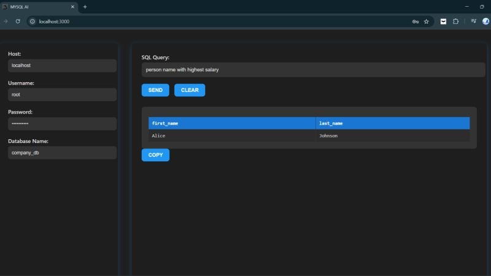

# 🔍 AI-Powered Natural Language to SQL Query System

An intelligent full-stack application that converts **natural language queries into SQL statements**, executes them on a MySQL database, and returns real-time structured results.

Powered by **Google Gemini LLM**, this system eliminates the need to manually write SQL queries and makes database interaction conversational.

---
### 🏠 Main Interface



## 🚀 Overview

This project allows users to query a database using plain English.

### Example:
> “Show all products sold in April 2025”

The system:
1. Understands the query using AI (Gemini)
2. Detects relevant database tables & columns
3. Generates SQL automatically
4. Executes it on MySQL
5. Returns structured results in UI

---

## 🧠 Architecture
```
User (Natural Language Query)
↓
React Frontend (UI Input Layer)
↓
Node.js + Express Backend (API Layer)
↓
Google Gemini AI (SQL Generation Engine)
↓
MySQL Database (Query Execution)
↓
Frontend (Displays Results in Table)
```
---

---

## ✨ Features

- 🧠 Natural Language → SQL conversion using AI
- 🗃️ Automatic schema detection (tables + columns)
- ⚡ Real-time SQL execution
- 📊 Dynamic table-based results UI
- 📋 Copy results to clipboard
- 🔌 Supports multiple databases (runtime selection)
- 🌐 Full-stack React + Node.js architecture
- 🔐 Environment-based secure configuration

---

## 🛠️ Tech Stack

### Frontend
- React.js ⚛️
- CSS

### Backend
- Node.js 🚀
- Express.js

### AI Engine
- Google Gemini API 🤖 (`@google/generative-ai`)

### Database
- MySQL2 🗃️

---

## 📂 Project Structure
```
project-root/
│
├── public/
│ ├── favicon.ico
│ ├── index.html
│ ├── logo512.png
│ └── manifest.json
│
├── src/
│ ├── Components/
│ ├── App.js
│ ├── App.css
│ ├── index.js
│ └── index.css
│
├── server.js # Backend (Express + Gemini + MySQL)
├── package.json
├── package-lock.json
├── .gitignore
└── README.md
```

---

## 🚀 Features

- 🧠 Convert natural language → SQL using Google Gemini AI
- 🗃️ Auto-detect database schema (tables & columns)
- ⚡ Executes SQL queries in real time
- 📊 Dynamic result rendering in frontend
- 🌐 Full-stack integration (React + Express)
- 🔌 Single backend entry (`server.js`)
- ⚙️ Easy database switching at runtime

---

## 🛠️ Tech Stack

### Frontend
- React.js ⚛️
- HTML5
- CSS3

### Backend
- Node.js 🚀
- Express.js

### AI Engine
- Google Gemini API 🤖 (`@google/generative-ai`)

### Database
- MySQL2 🗃️

---


## ⚙️ Installation & Setup

### 1️⃣ Clone the repository

```bash
git clone https://github.com/Pavan-Kumar-2095/MYSQL-AI/
cd ai-sql-project
npm install
```
### 2️⃣ Setup environment variables

Create a .env file in the root directory:
```bash
KEY=your_google_gemini_api_key
PORT=5000
```
### 3️⃣ Run the application
```bash
node server.js
```
### Server will run at:

http://localhost:5000

## 🧪 How to Use

### 1️⃣ Open the Application
Start the backend server and launch the React UI in your browser.

---

### 2️⃣ Enter Database Details

Provide your MySQL credentials:

- **Host** → `localhost`  
- **Username** → `root`  
- **Password** → your MySQL password  
- **Database** → e.g. `company_db`

---

### 3️⃣ Enter Natural Language Query

Type your query in plain English.

#### Example Queries:

- Show all employees in sales department  
- List products sold in April 2025  
- Get total revenue from orders table  
- Find top 10 customers by purchase amount  

---

### 4️⃣ Execute Query

Click the **SEND** button.

The system will:
- 🧠 Convert natural language → SQL using AI  
- ⚙️ Execute SQL on MySQL database  
- 📊 Display results in a structured table  

---

### 5️⃣ Copy Results

Click the **COPY** button to copy the output data to your clipboard.
