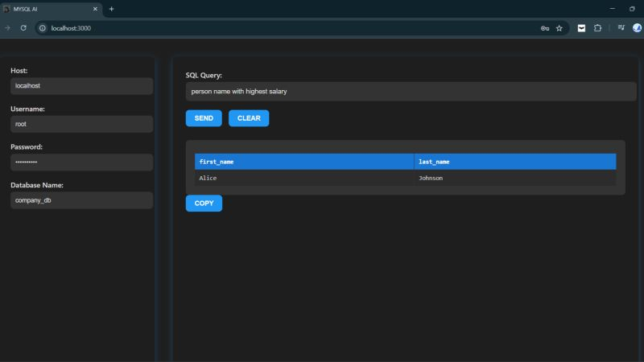

# AI-Powered Natural Language to SQL Query System

An intelligent full-stack application that converts **natural language queries into SQL statements**, executes them on a MySQL database, and returns structured results in real time.

Powered by **Google Gemini**, this application enables users to interact with databases using plain English instead of manually writing SQL queries.

---

## Application Preview

### Main Interface



---

# Overview

This application allows users to query a MySQL database using natural language.

### Example

> "Show all products sold in April 2025."

The system automatically:

1. Interprets the user's request using Google Gemini.
2. Detects the relevant database schema.
3. Generates the corresponding SQL query.
4. Executes the query on the MySQL database.
5. Displays the results in a structured table.

---

# System Architecture

```text
Natural Language Query
          │
          ▼
React Frontend
          │
          ▼
Node.js + Express Backend
          │
          ▼
Google Gemini API
(SQL Generation)
          │
          ▼
MySQL Database
(Query Execution)
          │
          ▼
Structured Results
```

---

# Features

- Natural Language to SQL conversion using Google Gemini
- Automatic database schema detection (tables and columns)
- Real-time SQL query execution
- Dynamic table-based result visualization
- Copy query results to the clipboard
- Runtime database selection
- Full-stack architecture using React and Express
- Environment-based secure configuration

---

# Tech Stack

| Component | Technology |
|----------|------------|
| Frontend | React.js, HTML5, CSS3 |
| Backend | Node.js, Express.js |
| AI Engine | Google Gemini API (`@google/generative-ai`) |
| Database | MySQL2 |

---

# Project Structure

```text
project-root/
├── public/
│   ├── Demo.jpg
│   ├── favicon.ico
│   ├── index.html
│   ├── logo512.png
│   └── manifest.json
│
├── src/
│   ├── Components/
│   ├── App.js
│   ├── App.css
│   ├── index.js
│   └── index.css
│
├── server.js
├── package.json
├── package-lock.json
├── .gitignore
└── README.md
```

---

# Installation

## 1. Clone the Repository

```bash
git clone https://github.com/Pavan-Kumar-2095/MYSQL-AI.git
cd MYSQL-AI
```

## 2. Install Dependencies

```bash
npm install
```

## 3. Configure Environment Variables

Create a `.env` file in the project root.

```env
KEY=your_google_gemini_api_key
PORT=5000
```

## 4. Start the Server

```bash
node server.js
```

The server will be available at:

```
http://localhost:5000
```

---

# How to Use

## Step 1: Start the Application

Run the backend server and open the React application in your browser.

---

## Step 2: Connect to Your Database

Enter your MySQL connection details:

- Host (e.g., `localhost`)
- Username
- Password
- Database Name

---

## Step 3: Enter a Natural Language Query

Examples:

- Show all employees in the Sales department.
- List products sold in April 2025.
- Get the total revenue from the orders table.
- Find the top 10 customers by purchase amount.

---

## Step 4: Execute the Query

Click the **Send** button.

The application will:

1. Convert the natural language request into SQL.
2. Execute the generated SQL query.
3. Display the results in a structured table.

---

## Step 5: Copy Results

Use the **Copy** button to copy the generated output to your clipboard.

---

# Workflow

```text
User Query
      │
      ▼
Google Gemini
(Natural Language → SQL)
      │
      ▼
Generated SQL
      │
      ▼
MySQL Database
      │
      ▼
Query Results
      │
      ▼
React Frontend
```

---

# Applications

- AI-powered database assistants
- Business intelligence dashboards
- Internal analytics tools
- Enterprise data exploration
- SQL learning assistants
- Conversational database interfaces